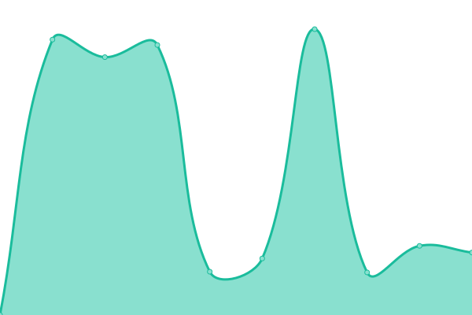

# [📈 Live Status](https://newstatus.mufin.lol): <!--live status--> **🟧 Partial outage**

This repository contains the open-source uptime monitor and status page for [MSQUARE](https://newstatus.mufin.lol), powered by [Upptime](https://github.com/upptime/upptime).

With [Upptime](https://upptime.js.org), you can get your own unlimited and free uptime monitor and status page, powered entirely by a GitHub repository. We use [Issues](https://github.com/globalmsq/mufin-uptime/issues) as incident reports, [Actions](https://github.com/globalmsq/mufin-uptime/actions) as uptime monitors, and [Pages](https://newstatus.mufin.lol) for the status page.

<!--start: status pages-->
<!-- This summary is generated by Upptime (https://github.com/upptime/upptime) -->
<!-- Do not edit this manually, your changes will be overwritten -->
<!-- prettier-ignore -->
| URL | Status | History | Response Time | Uptime |
| --- | ------ | ------- | ------------- | ------ |
|  [Businesshub Dev](https://dev.businesshub.co.kr/) | 🟩 Up | [businesshub-dev.yml](https://github.com/globalmsq/mufin-uptime/commits/HEAD/history/businesshub-dev.yml) | 

 2091ms
     
 | 

<a href="https://newstatus.mufin.lol/history/businesshub-dev">100.00%</a>
    

|  [Businesshub Stg](https://stg.businesshub.co.kr/) | 🟩 Up | [businesshub-stg.yml](https://github.com/globalmsq/mufin-uptime/commits/HEAD/history/businesshub-stg.yml) | 

 1743ms
     
 | 

<a href="https://newstatus.mufin.lol/history/businesshub-stg">100.00%</a>
    

|  [Businesshub Prd](https://businesshub.co.kr/) | 🟩 Up | [businesshub-prd.yml](https://github.com/globalmsq/mufin-uptime/commits/HEAD/history/businesshub-prd.yml) | 

 2228ms
     
 | 

<a href="https://newstatus.mufin.lol/history/businesshub-prd">100.00%</a>
    

|  [Businesshub ERP Dev](https://dev-erp.businesshub.co.kr/) | 🟩 Up | [businesshub-erp-dev.yml](https://github.com/globalmsq/mufin-uptime/commits/HEAD/history/businesshub-erp-dev.yml) | 

 1318ms
     
 | 

<a href="https://newstatus.mufin.lol/history/businesshub-erp-dev">100.00%</a>
    

|  [Businesshub ERP Stg](https://stg-erp.businesshub.co.kr/) | 🟩 Up | [businesshub-erp-stg.yml](https://github.com/globalmsq/mufin-uptime/commits/HEAD/history/businesshub-erp-stg.yml) | 

 1428ms
     
 | 

<a href="https://newstatus.mufin.lol/history/businesshub-erp-stg">100.00%</a>
    

|  [Businesshub ERP Prd](https://erp.businesshub.co.kr/) | 🟩 Up | [businesshub-erp-prd.yml](https://github.com/globalmsq/mufin-uptime/commits/HEAD/history/businesshub-erp-prd.yml) | 

 1355ms
     
 | 

<a href="https://newstatus.mufin.lol/history/businesshub-erp-prd">100.00%</a>
    

|  [54DNA Dev](https://dev.54dnatype.com/) | 🟩 Up | [54-dna-dev.yml](https://github.com/globalmsq/mufin-uptime/commits/HEAD/history/54-dna-dev.yml) | 

 860ms
     
 | 

<a href="https://newstatus.mufin.lol/history/54-dna-dev">100.00%</a>
    

|  [54DNA Prd](https://www.54dnatype.com/) | 🟩 Up | [54-dna-prd.yml](https://github.com/globalmsq/mufin-uptime/commits/HEAD/history/54-dna-prd.yml) | 

 572ms
     
 | 

<a href="https://newstatus.mufin.lol/history/54-dna-prd">100.00%</a>
    

|  [54DNA API Dev](dev-api.54dnatype.com) | 🟩 Up | [54-dna-api-dev.yml](https://github.com/globalmsq/mufin-uptime/commits/HEAD/history/54-dna-api-dev.yml) | 

 176ms
     
 | 

<a href="https://newstatus.mufin.lol/history/54-dna-api-dev">100.00%</a>
    

|  [54DNA API Prd](api.54dnatype.com) | 🟩 Up | [54-dna-api-prd.yml](https://github.com/globalmsq/mufin-uptime/commits/HEAD/history/54-dna-api-prd.yml) | 

 177ms
     
 | 

<a href="https://newstatus.mufin.lol/history/54-dna-api-prd">100.00%</a>
    

|  [Mufin Translator Dev](https://dev-translator.mufin.lol/) | 🟩 Up | [mufin-translator-dev.yml](https://github.com/globalmsq/mufin-uptime/commits/HEAD/history/mufin-translator-dev.yml) | 

 3116ms
     
 | 

<a href="https://newstatus.mufin.lol/history/mufin-translator-dev">100.00%</a>
    

|  [Mufin Translator Stg](https://stg-translator.mufin.lol/) | 🟩 Up | [mufin-translator-stg.yml](https://github.com/globalmsq/mufin-uptime/commits/HEAD/history/mufin-translator-stg.yml) | 

 2015ms
     
 | 

<a href="https://newstatus.mufin.lol/history/mufin-translator-stg">100.00%</a>
    

|  [Mufin Translator Prd](https://translator.mufin.lol/) | 🟩 Up | [mufin-translator-prd.yml](https://github.com/globalmsq/mufin-uptime/commits/HEAD/history/mufin-translator-prd.yml) | 

 2083ms
     
 | 

<a href="https://newstatus.mufin.lol/history/mufin-translator-prd">100.00%</a>
    

|  [Mufin Translator API Dev](https://dev-api-translator.mufin.lol/) | 🟩 Up | [mufin-translator-api-dev.yml](https://github.com/globalmsq/mufin-uptime/commits/HEAD/history/mufin-translator-api-dev.yml) | 

 2264ms
     
 | 

<a href="https://newstatus.mufin.lol/history/mufin-translator-api-dev">100.00%</a>
    

|  [Mufin Translator API Stg](https://stg-api-translator.mufin.lol/) | 🟥 Down | [mufin-translator-api-stg.yml](https://github.com/globalmsq/mufin-uptime/commits/HEAD/history/mufin-translator-api-stg.yml) | 

 1495ms
     
 | 

<a href="https://newstatus.mufin.lol/history/mufin-translator-api-stg">99.99%</a>
    

|  [Mufin Translator API Prd](https://prd-api-translator.mufin.lol/) | 🟩 Up | [mufin-translator-api-prd.yml](https://github.com/globalmsq/mufin-uptime/commits/HEAD/history/mufin-translator-api-prd.yml) | 

 1726ms
     
 | 

<a href="https://newstatus.mufin.lol/history/mufin-translator-api-prd">100.00%</a>
    

<!--end: status pages-->

[**Visit our status website →**](https://newstatus.mufin.lol)

## 📄 License

- Powered by: [Upptime](https://github.com/upptime/upptime)
- Code: [MIT](./LICENSE) © [Anand Chowdhary](https://anandchowdhary.com), supported by [Pabio](https://pabio.com)
- Data in the `./history` directory: [Open Database License](https://opendatacommons.org/licenses/odbl/1-0/)
