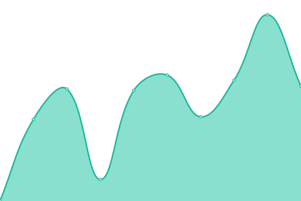
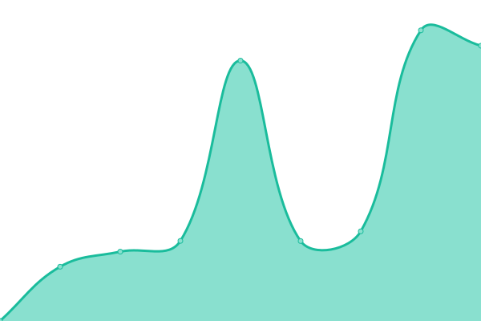
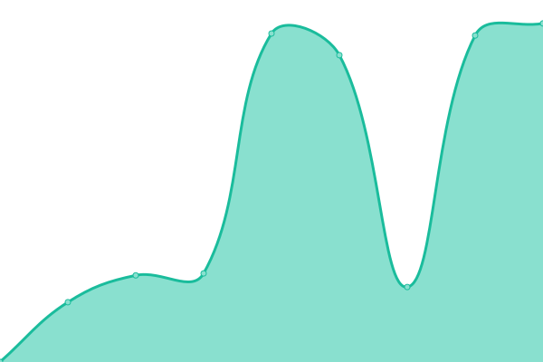

# [📈 Live Status](https://newstatus.mufin.lol): <!--live status--> **🟩 All systems operational**

This repository contains the open-source uptime monitor and status page for [MSQUARE](https://newstatus.mufin.lol), powered by [Upptime](https://github.com/upptime/upptime).

With [Upptime](https://upptime.js.org), you can get your own unlimited and free uptime monitor and status page, powered entirely by a GitHub repository. We use [Issues](https://github.com/globalmsq/mufin-uptime/issues) as incident reports, [Actions](https://github.com/globalmsq/mufin-uptime/actions) as uptime monitors, and [Pages](https://newstatus.mufin.lol) for the status page.

<!--start: status pages-->
<!-- This summary is generated by Upptime (https://github.com/upptime/upptime) -->
<!-- Do not edit this manually, your changes will be overwritten -->
<!-- prettier-ignore -->
| URL | Status | History | Response Time | Uptime |
| --- | ------ | ------- | ------------- | ------ |
|  [Businesshub Prd](https://businesshub.co.kr/) | 🟩 Up | [businesshub-prd.yml](https://github.com/globalmsq/mufin-uptime/commits/HEAD/history/businesshub-prd.yml) | 

 2028ms
     
 | 

<a href="https://newstatus.mufin.lol/history/businesshub-prd">100.00%</a>
    

|  [Businesshub ERP Prd](https://erp.businesshub.co.kr/) | 🟩 Up | [businesshub-erp-prd.yml](https://github.com/globalmsq/mufin-uptime/commits/HEAD/history/businesshub-erp-prd.yml) | 

 1477ms
     
 | 

<a href="https://newstatus.mufin.lol/history/businesshub-erp-prd">100.00%</a>
    

|  [54DNA Prd](https://www.54dnatype.com/) | 🟩 Up | [54-dna-prd.yml](https://github.com/globalmsq/mufin-uptime/commits/HEAD/history/54-dna-prd.yml) | 

 465ms
     
 | 

<a href="https://newstatus.mufin.lol/history/54-dna-prd">100.00%</a>
    

|  [54DNA API Prd](api.54dnatype.com) | 🟩 Up | [54-dna-api-prd.yml](https://github.com/globalmsq/mufin-uptime/commits/HEAD/history/54-dna-api-prd.yml) | 

 172ms
     
 | 

<a href="https://newstatus.mufin.lol/history/54-dna-api-prd">100.00%</a>
    

|  [Mufin Translator Prd](https://translator.mufin.lol/) | 🟩 Up | [mufin-translator-prd.yml](https://github.com/globalmsq/mufin-uptime/commits/HEAD/history/mufin-translator-prd.yml) | 

 2911ms
     
 | 

<a href="https://newstatus.mufin.lol/history/mufin-translator-prd">100.00%</a>
    

|  [Mufin Translator API Prd](https://prd-api-translator.mufin.lol/) | 🟩 Up | [mufin-translator-api-prd.yml](https://github.com/globalmsq/mufin-uptime/commits/HEAD/history/mufin-translator-api-prd.yml) | 

 2369ms
     
 | 

<a href="https://newstatus.mufin.lol/history/mufin-translator-api-prd">100.00%</a>
    

|  [P2U Prd](https://p2u.kr) | 🟩 Up | [p2-u-prd.yml](https://github.com/globalmsq/mufin-uptime/commits/HEAD/history/p2-u-prd.yml) | 

 1846ms
     
 | 

<a href="https://newstatus.mufin.lol/history/p2-u-prd">100.00%</a>
    

|  [MSQ Landing Page](https://msq.market) | 🟩 Up | [msq-landing-page.yml](https://github.com/globalmsq/mufin-uptime/commits/HEAD/history/msq-landing-page.yml) | 

 262ms
     
 | 

<a href="https://newstatus.mufin.lol/history/msq-landing-page">100.00%</a>
    

|  [Icarus](https://icarus.mufin.lol) | 🟩 Up | [icarus.yml](https://github.com/globalmsq/mufin-uptime/commits/HEAD/history/icarus.yml) | 

 5265ms
     
 | 

<a href="https://newstatus.mufin.lol/history/icarus">100.00%</a>
    

|  [GlobalMSQ](https://globalmsq.com) | 🟩 Up | [global-msq.yml](https://github.com/globalmsq/mufin-uptime/commits/HEAD/history/global-msq.yml) | 

 1289ms
     
 | 

<a href="https://newstatus.mufin.lol/history/global-msq">100.00%</a>
    

|  [Must Fintech Homepage](https://mufin.co.kr) | 🟩 Up | [must-fintech-homepage.yml](https://github.com/globalmsq/mufin-uptime/commits/HEAD/history/must-fintech-homepage.yml) | 

 1089ms
     
 | 

<a href="https://newstatus.mufin.lol/history/must-fintech-homepage">100.00%</a>
    

|  [Mufin Mailu](https://mail.mufin.co.kr) | 🟩 Up | [mufin-mailu.yml](https://github.com/globalmsq/mufin-uptime/commits/HEAD/history/mufin-mailu.yml) | 

 1004ms
     
 | 

<a href="https://newstatus.mufin.lol/history/mufin-mailu">100.00%</a>
    

|  [Mufin Mailu SMTP](mail.mufin.co.kr) | 🟩 Up | [mufin-mailu-smtp.yml](https://github.com/globalmsq/mufin-uptime/commits/HEAD/history/mufin-mailu-smtp.yml) | 

 172ms
     
 | 

<a href="https://newstatus.mufin.lol/history/mufin-mailu-smtp">100.00%</a>
    

|  [Mufin Mailu IMAP](mail.mufin.co.kr) | 🟩 Up | [mufin-mailu-imap.yml](https://github.com/globalmsq/mufin-uptime/commits/HEAD/history/mufin-mailu-imap.yml) | 

 172ms
     
 | 

<a href="https://newstatus.mufin.lol/history/mufin-mailu-imap">100.00%</a>
    

<!--end: status pages-->

[**Visit our status website →**](https://newstatus.mufin.lol)

## 📄 License

- Powered by: [Upptime](https://github.com/upptime/upptime)
- Code: [MIT](./LICENSE) © [Anand Chowdhary](https://anandchowdhary.com), supported by [Pabio](https://pabio.com)
- Data in the `./history` directory: [Open Database License](https://opendatacommons.org/licenses/odbl/1-0/)
